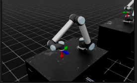

# 伊藤弘顕がIsaacLabを改良したリポジトリ

[](https://docs.omniverse.nvidia.com/isaacsim/latest/overview.html)
[](https://docs.python.org/3/whatsnew/3.10.html)
[](https://releases.ubuntu.com/20.04/)
[](https://www.microsoft.com/en-us/)
[](https://github.com/isaac-sim/IsaacLab/actions/workflows/pre-commit.yaml)
[](https://github.com/isaac-sim/IsaacLab/actions/workflows/docs.yaml)
[](https://opensource.org/licenses/BSD-3-Clause)

## IsaacLabについて
強化学習を使って様々なロボットの運動を学習させる。特徴としてGPUを用いた並列計算が可能である。
## a

## 引用先
引用したIsaacLabの情報は以下の通り。
### URL
https://github.com/isaac-sim/IsaacLab
### License

The Isaac Lab framework is released under [BSD-3 License](LICENSE). The license files of its dependencies and assets are present in the [`docs/licenses`](docs/licenses) directory.

### Acknowledgement

Isaac Lab development initiated from the [Orbit](https://isaac-orbit.github.io/) framework. We would appreciate if you would cite it in academic publications as well:

```
@article{mittal2023orbit,
   author={Mittal, Mayank and Yu, Calvin and Yu, Qinxi and Liu, Jingzhou and Rudin, Nikita and Hoeller, David and Yuan, Jia Lin and Singh, Ritvik and Guo, Yunrong and Mazhar, Hammad and Mandlekar, Ajay and Babich, Buck and State, Gavriel and Hutter, Marco and Garg, Animesh},
   journal={IEEE Robotics and Automation Letters},
   title={Orbit: A Unified Simulation Framework for Interactive Robot Learning Environments},
   year={2023},
   volume={8},
   number={6},
   pages={3740-3747},
   doi={10.1109/LRA.2023.3270034}
}
```
